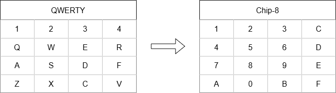

# Chip8 Emulator

This is a Chip8 emulator project developed in C#. Chip8 is an interpreted programming language that was originally implemented on certain computers and gaming consoles in the 1970s. This emulator allows you to run programs written for Chip8 on a modern environment.

One of the goals is to provide an educational example of how to build an emulator.

## Features

- Full emulation of the Chip8 instruction set
- Support for graphics
- Support for keyboard input

## Requirements

- .NET 8 or higher

## Usage
Unzip the file for your operating system, in the [dist](https://github.com/hadiljr/chip8-emulator/tree/master/dist)

Alternatively, download the project and compile it for your system.

### Linux
``./Emulator rom-path``

Example:

``./Emulator ./space-invaders.ch8``

### Windows

``./Emulator.exe rom-path``

Example:

``./Emulator.exe ./space-invaders.ch8``

### Notes about Usage

The emulator does not provide any Chip-8 ROMs. There are several websites and repositories where these ROMs are in the public domain and can be legally downloaded and used.

If no ROM path is provided, it will load the default ROM with the following image:

## Inputs

**ESC** - Exits the emulator.
> Note: the window must be selected

### Mapa das teclas:

## References I followed for the implementation of this emulator
- http://devernay.free.fr/hacks/chip8/C8TECH10.HTM
- https://www.laurencescotford.net/2020/07/19/chip-8-on-the-cosmac-vip-drawing-sprites/
- https://github.com/Timendus/chip8-test-suite?tab=readme-ov-file

