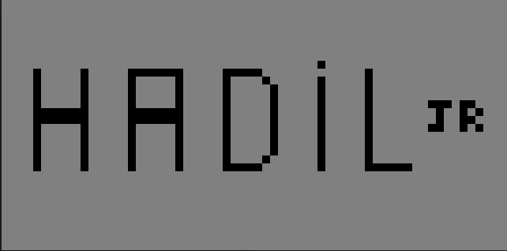
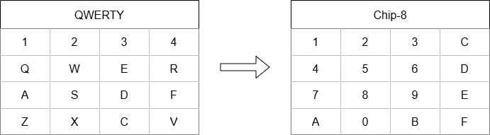

# Chip8 Emulator

Este é um projeto de um emulador Chip8 desenvolvido em C#. O Chip8 é uma linguagem de programação interpretada que foi originalmente implementada em alguns computadores e consoles de jogos na década de 1970. Este emulador permite executar programas escritos para o Chip8 em um ambiente moderno.

Projeto que levou a criação do artigo [Criando um Emulador - Chip 8]()

Um dos objetivos é fornecer um exemplo didático de como se constroi um emulador.

## Funcionalidades

- Emulação completa do conjunto de instruções do Chip8
- Suporte para gráficos
- Suporte para entrada via teclado

## Requisitos

- .NET 8 ou superior

## Uso
Descompactar o arquivo para o seu sistema operacional, na pasta [dist](https://github.com/hadiljr/chip8-emulator/tree/master/dist)

Alternativamente baixe o projeto e compile para o seu sistema.

### Linux
``./Emulator caminho-da-rom``

ex:

``./Emulator ./space-invaders.ch8``

### Windows

``./Emulator.exe caminho-da-rom``

ex:

``./Emulator.exe ./space-invaders.ch8``

### Notas de Uso

O emulador não provém nenhuma rom de chip-8, existem diversos sites e repositórios que essas roms estão sob domínio público podem ser baixadas e utilizadas legalmente.

Se não colocar um caminho da rom, irá carregar a rom padrão com a seguinte imagem:

## Inputs

**ESC** - Encerra o emulador. 
> Obs: a janela deve estar selecionada

### Mapa das teclas:

## Referencias que segui para implementação desse emulador
- http://devernay.free.fr/hacks/chip8/C8TECH10.HTM
- https://www.laurencescotford.net/2020/07/19/chip-8-on-the-cosmac-vip-drawing-sprites/
- https://github.com/Timendus/chip8-test-suite?tab=readme-ov-file

